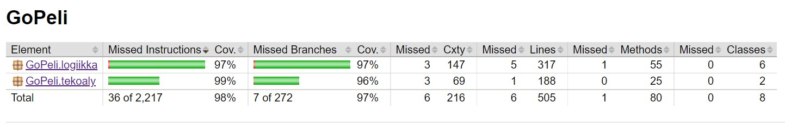

# Testikattavuusraportti

Jacocon testikattavuusraportin voi generoida ajamalla testit. Testit ajetaan komennolla `gradle test`.
Testien ajamisen jälkeen testikattavuusraportti löytyy polusta `/GoPeli/build/reports/jacoco/test/html/index.html`

### Ohjelman testikattavuus kokonaisuutena
