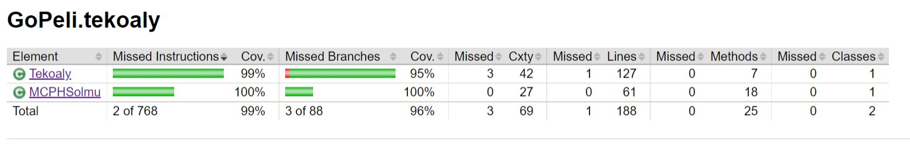

# Testikattavuusraportti

Jacocon testikattavuusraportin voi generoida ajamalla testit. Testit ajetaan komennolla `gradle test`.  
Testien ajamisen jälkeen testikattavuusraportti löytyy polusta `/GoPeli/build/reports/jacoco/test/html/index.html`  

Käyttöliittymä on jätetty pois testikattavuuden piiristä. Sen pois jättö on huomioitu gradlen konfiguraatiossa, joten se ei näy
Jacocon raportissa.

## Ohjelman testikattavuus kokonaisuutena

## Ohjelman logiikan testikattavuus

### Siirto-luokka

Ohjelmalogiikan testikattavuudessa ainoa testien ulkopuolelle jäänyt alue on Siirto-luokassa. Tarkemmin Siirto-luokan hashCode()-metodi
joka ei tullut testatuksi. En itseasiassa tiedä tarkkaa syytä, miksi kyseinen metodi jäi testien ulkopuolelle, sillä muissa ohjelman
logiikasta vastaavissa luokissa hashCode()-metodi tuli sisällytetyksi testeihin, kun equals-metodi testattiin. En lähtenyt erikseen
kyseiselle metodille tekemään testejä, sillä en nähnyt sitä mielekkääksi, kun kyseessä on NetBeansin generoima hashCode()-metodi.

### Pelitilanne-luokka

Pelitilanne-luokan laskeVoittaja()-metodia on testattu kahdessa tapauksessa, sekä mustan, että valkoisen voittaessa.  

Mustan tilanteessa on generoitu lautatilanne, jossa molemmilla pelaajilla on yksi elävä ryhmä, eli ryhmä joka sisältää useamman kuin
yhden silmän. Ryhmät on jaettu niin, että mustan ryhmä täyttää laudan viisi(5) ylintä riviä ja valkean ryhmä neljä(4) alinta riviä.  
Tällöin mustalla on laudalla yhden rivin verran enemmän kiviä, mikä tekee 9 pistettä enemmän ja kun valkoinen saa komin (7,5 pistettä)
lautatilanteen lisäksi, niin musta voittaa pelin 1,5 pisteen erolla.  

Valkoisen voittotilanne on generoitu samaan tapaan, jakaen laudan kahteen osaan, jossa musta saa laudan oikeasta ylänurkasta kolmion
muotoisen alueen (rivi < sarake) ja valkoinen taas vasemmasta alanurkasta isomman alueen, kun diagonaali vasemmasta ylänurkasta oikeaan
alanurkkaan liittyy valkoisen ryhmään. Ja näille ryhmille on jätetty tila silmille kaavalla |rivi - sarake| != 2.

Kyseinen metodi osaa laskea pisteet vain tilanteessa, jossa silmät ovat yhden pisteen kokoisia.

Toinen huomionarvoinen metodi on lisaaSiirto(), tätä on testattu useassa eri tapauksessa, joissa on käyty läpi kaikki eri virhetyypit
kun siirto on laiton, sekä onnistunut siirto useammassa tapauksessa, jossa siirto kaappaa vastustajan kiviä.

### Pelilauta-luokka

Pelilauta-luokan testit koostuvat suurelta osin lisaaSiirto()-metodin testaamisesta, sillä sen toteutus on suurin osa luokkaa.
Toteutukseen sisältyy poistaRyhma(Ryhma)-apumetodi. En käy tässä tarkemmin läpi miten testaus on suoritettu.

### Muut logiikkaluokat

Muissa logiikasta vastaavissa luokissa ei ole juurikaan mitään erityistä huomion arvoista testauksessa.

## Ohjelman tekoälyn testikattavuus

### Tekoaly-luokka

Tekoaly-luokka koostuu pääosin valitseSiirto-metodista ja sen käyttämästä yksityisestä simuloiSattumanvarainenPeli-metodista.  
Näistä valitseSiirto-metodi ei ole aivan kokonaan testattu, koska en keksinyt miten saisin järkevästi generoitua pelitilanteita, joilla
puuttuvat osat saisi testattua.

Tekoaly-luokan metodissa valitseSiirto rivillä 36, testit eivät käy yhdessä neljästä while-haarasta. Tämä on itseasiassa iso ongelma,
sillä ohjelmassa on bugi, joka aiheuttaa NullPointerExceptionin kyseisellä rivillä. Tämä tapahtuu tilanteessa, jossa tekoälyn pitäisi
valita siirto kun järkeviä siirtopaikkoja ei ole jäljellä, vaan sen pitäisi passata. Itseasiassa voi olla, että tämä tulee jo, kun on
yksi paikka mihin pelata jäljellä. Koska olin pahasti kurssin aikataulusta jäljessä, en ehtinyt testejä kirjoittaa tälle luokalle
samantien, vaan vasta jälkikäteen, kun lähestulkoon koko luokka oli toteutettu. Löysin tämän bugin vasta demotilaisuuden jälkeen, kun
testasin ohjelman toimintaa empiirisillä kokeilla (pelaamalla tekoälyä vastaan) ja yritin generoida tilanteen, jossa tekoäly ei luovuta
vaan päästään pisteiden laskuun valkoisen johtoasemassa. Bugin havaitsemisen ajankohdasta johtuen, en lähtenyt enää sitä tutkimaan ja
korjaamaan, koska olen muutenkin myöhässä dokumentoinnin suhteen, joten se jää ohjelman tiralabrakurssin viimeiseen versioon.  

Havaitsin myös toisen bugin tekoälyssä samoissa empiirisissä kokeissa. Myös tämä tuli esille vain ym. tilanteessa ja tästä bugista
johtuen valkoisen vankimäärä näytetään käyttöliittymässä väärin tietyissä tilanteissa. Bugin takia valkoisen vankimäärä saattaa kasvaa
siirron seurauksena, joka ei kaappaa kiviä. Epäilen, että tämä saattaa olla korjattavissa sillä, että pelitilanteesta tekee syväkopion
tekoälyn käyttöön, kun se valitsee siirtoa, jolloin pelin simulointi ei muokkaa alkuperäistä Pelitilanne-oliota. Tätäkään tosin en ole
aikasyistä ehtinyt tutkia ja korjata, sillä en nähnyt sitä mielekkääksi ajankäytöksi, sillä vankimäärät helpottavat vain ihmispelaajan
pisteiden laskua.

simuloiSattumanvarainenPeli-metodi tuli käydyksi läpi valitseSiirto-metodin testauksella, sillä kyseessä on yksityinen metodi, jota
valitseSiirto käyttää.

### MCPHSolmu-luokka

Tällä luokalla on täysi testikattavuus ja en keksi oikein mitään huomionarvoista, koska luokan metodit ovat suhteellisen yksinkertaisia.